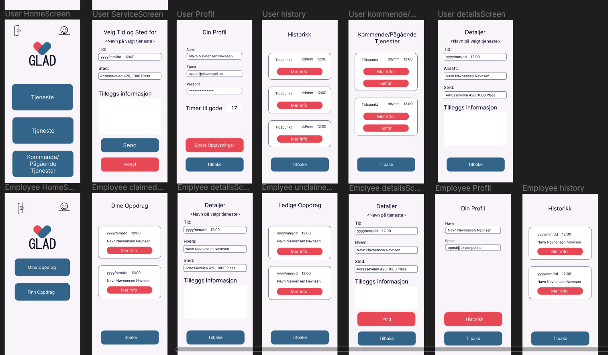
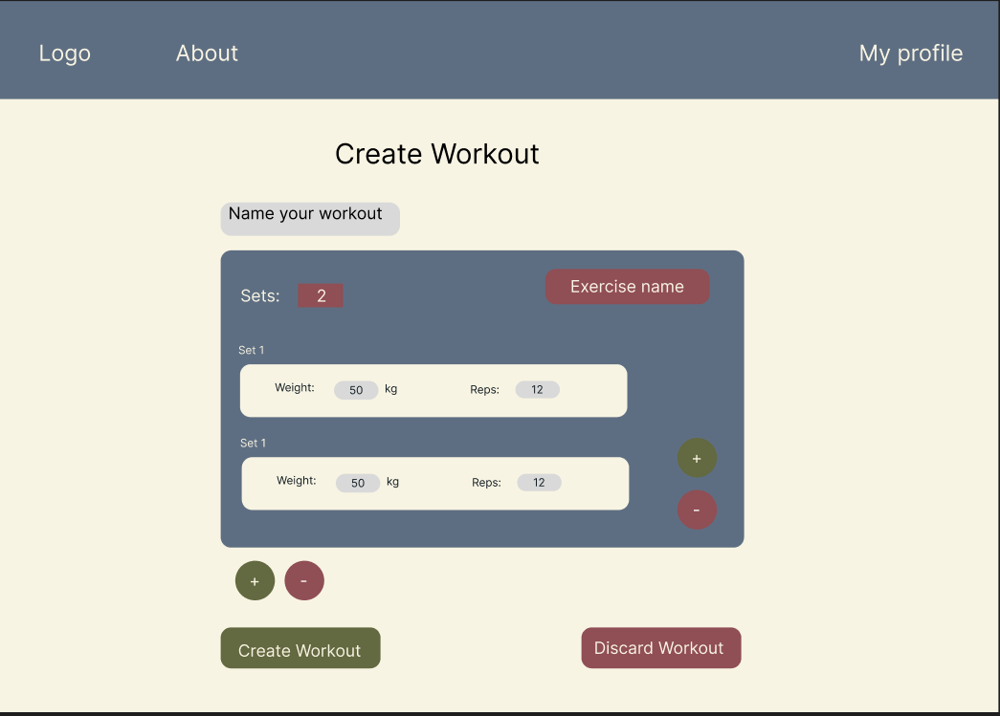

<!-- This readme is inspired by the video of ForestKnight on YouTube: https://www.youtube.com/watch?v=ECuqb5Tv9qI, and DenverCoder1's readme: https://github.com/DenverCoder1/DenverCoder1 -->

## Hi there 👋
My name is Daniel Sandøy 🇳🇴, and I'm an aspiring Software Developer enrolled in Software Engineering at the University of Agder. I'm currently working on a few projects both at university and privately, and I'm always looking for new opportunities to learn and grow as a developer. 

<!-- Icons from: https://devicon.dev/ -->

  
👨‍💻Languages and tools 

  

    
    
    
    
    
    
    
    
    
     
     
    
    
    
    
    
    
    
    
                 
  

  

   
   

## 💻 Current Projects

 😃 GLAD 
 
GLAD is a mobile application created in React Native, and a unviersity project I am currently working on as the project leader.

*This is the design of the application. It is implemented according to the design.*

As this is a work in progress and will count toward my grade, I unfortunately cannot share the code for this project yet.

**<h3>Technologies used</h3>**

 
 

***

 🏋️‍♂️ WhatX 

WhatX is a personal project that came about because I want to know what I am to exercise at the gym and create my own workouts. With a website to create and edit workouts, and a mobile application to view and complete them.

It is currently at a very early stage, but I am working on it in my free time.

**<h3>Technologies used</h3>** 

  
          

  

  
  

